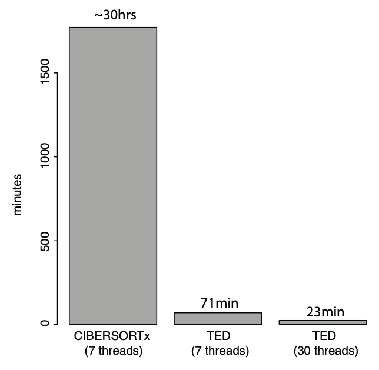

TED (now called BayesPrism)
========

Bayesian cell Proportion Reconstruction Inferred using Statistical Marginalization (BayesPrism): A Fully Bayesian Inference of Tumor Microenvironment composition and gene expression

BayesPrism consists of the deconvolution modules and the embedding learning module. The deconvolution module leverages cell type-specific expression profiles from scRNA-seq and implements a fully Bayesian inference to jointly estimate the posterior distribution of cell type composition and cell type-specific gene expression from bulk RNA-seq expression of tumor samples. The embedding learning module uses Expectation-maximization (EM) to approximate the tumor expression using a linear combination of tumor pathways while conditional on the inferred expression and fraction of non-tumor cells estimated by the deconvolution module. 

v1.1: added new features that allow the use of the cell subtypes / cell states information obtained from scRNA-seq data (e.g. by finer-level clustering), which yields finer-grained cell types to better represent a heterogeneous population. It can be used to define, for example, myeloid or lymphocyte populations in the tumor microenvironment. BayesPrism will compute the posterior sum over these subtypes/states.

v1.2: added function cleanup.genes that helps clean up genes sensitive to batch effects, including 1) ribosomal genes, 2) mitochondrial genes, and 3) genes in chrM and chrY. Developed for mouse and human annotations. 

v1.3: added function get.signature.genes that uses hierarchical clustering to get signature genes. Subsetting on signature genes is helpful when batch effects are severe while reference cell types are similar in gene expression profiles. (help function to be added soon)

v2.0: added two new functions estimate_sf and convert.cell.fraction (vignette and help function to be added soon), and updated a new tutorial example with both raw scRNA data and GEP and vignette. These two new functions convert fraction of reads of each cell type (from the run.Ted output) to the fraction of number of cells. Users are recommended to stick to the original fraction of reads of each cell type (the original run.Ted output) as it is more accurate and also sufficient for most applications. 

Cite BayesPrism:
--------
Bayesian cell-type deconvolution and gene expression inference reveals tumor-microenvironment interactions

Tinyi Chu and Charles Danko

https://www.biorxiv.org/content/10.1101/2020.01.07.897900v3

--------


Workflow of BayesPrism
--------


Requires
--------

* R packages:
	
	DESeq2(>1.22.2), MCMCpack(> 1.4-4), parallel, gplots, scran, BiocParallel
	
Installation
--------

* If all dependent packages and commands have been installed, please use the following codes to install/update the package in R terminal. 

```````
library("devtools");
install_github("Danko-Lab/TED/TED")
```````


Usage
----------
library(TED)

use ?function_name for more details

utility function:
cleanup.genes, get.signature.genes

R functions:
run.Ted, learn.embedding.withPhiTum, learn.embedding.Kcls

	
Output
----------
use ?function_name for more details


Generating the reference expression matrix from scRNA-seq data (FAQ)
----------------------------------------------------------------------
1) What if there are missing cell types?

BayesPrism assumes that the expression profiles for all cells are observed. As a result, we recommend the use of complete enumeration of cell types whenever possible. When the completeness assumption is violated, the fractions of each of the remaining cell types will become inflated. The extent of inflation is determined by the similarity in their expression to the missing cell type(s).

When information on subtypes of T cells, such as CD4+, CD8+, Treg, etc, are available, user should use the individual subtype as the reference (cell.type.labels) rather than a generic “T cell” by collapsing multiple subtypes. For more finer-grained cell states within each cell type, users can use the cell.subtype.labels argument to mark these states. 

2) How to label tumor reference?

Although BayesPrism does not assume the expression of tumor cells are completely observed in the scRNA-seq reference, its performance depends on the extent to which the reference tumor expressions represent those in bulk RNA-seq. To obtain the best possible representation for the unobserved tumor expression in bulk RNA-seq, we recommend users to cluster the scRNA-seq data of tumor cells in individual patients, and then mark them using cell.subtype.labels. 

3) How many tumor references are needed?

The number of patients needed for the reference mostly depends on the degree of heterogeneity of the tumor. In the deconvolution of GBM, we found a scRNA-seq reference containing ~ 4 patients generated by Yuan et al. was sufficient to achieve a good performance. We recommend users to determine the representativeness of the tumor cells by running the leave-one-out test, and then decide if the collection/curation for additional tumor samples are needed. 

4) What cell types are "dangerous" to include in the reference (only applicable to deconvolving tumors from unmatched samples)?

Users should be cautious when normal tissues of highly similar transcription profiles to the tumor cells are included in the reference, especially those represent the tumor cell origins. For example the inclusion of normal astrocyte to deconvolve GBM may cause the astrocytes to be overestimated and the tumor cells to be underestimated. Such an issue resulting from highly similar transcription profiles will mainly affect the inference of tumor cells, but not stromal cells (such as the inference of multiple subtypes of T cell), due to the under-representativeness of tumor cells in the reference caused by tumor heterogeneity.  Note that this issue is not specific to BayesPrism. In fact, any regression approaches will suffer when one reference component does not sufficiently represent that in the mixture while additional components of similar expression profiles are also included in the reference. Nevertheless, most stromal cells, such as immune, endothelial, fibroblast and even oligodendrocytes in GBM do not show this issue across the three tumor types we tested. This issue can also be avoided by domain knowledge or running the leave-one-out test. Users can also subset the scRNA-seq reference on signature genes to ameliorate this issue.

4) How to clean up the scRNA-seq reference and bulk mixture? Are marker genes (signature genes) required?

Different RNA-seq platforms may contain systematic batch effects that cannot be corrected by BayesPrism. Loosely speaking, BayesPrism can correct batch effects for genes where the relative expression among cell types holds across platforms. Therefore, genes that are highly expressed in the mixture but are not detectable in the reference profile should be excluded. The run.Ted function removes any genes in the mixture greater than 5% in any of the mixture samples by default. This threshold is very lenient, and does not filter out genes in a library with good mapping quality control. 

We also highly recommend  excluding ribosomal and mitochondrial genes and genes on the Y chromosome (if the sex are difference between reference and mixture) (now implemented by cleanup.genes function of the BayesPrism), as these genes are likely susceptible to batch effects. cleanup.genes function can also remove genes that have zero or low expression (expressed in less than # of cells) in scRNA-seq reference.

We found subsetting on signature genes sometimes moderately improves the accuracy in inferring cell types when 1) batch effects are severe and 2) the scRNA-se reference contains cell types highly similar in transcription, i.e. only a small number of differentially expressed genes. For users' convenience, we implemented a function get.signature.genes that uses hierarchical clustering schemes (based on cell.type.labels) and search for marker genes between clusters of different levels (using the findMarkers function from the scran package). Users should note that BayesPrism infers the fraction of reads over the given gene set. So when only signature genes are used, the fraction is interpreted as the fraction of reads of cell type X over those signature genes. 

5) Do I need to normalize the data or align them? 

NO. BayesPrism uses the raw count to generate the reference profile, and automatically normalizes each cell by its total count. To avoid exact zeros in the reference profile. The package automatically adds a computed pseudo count to each cell type, such that after normalization the zero counted genes have the same value (default=10-8) across all cell types. Users may either provide a collapsed reference gene expression profile (input.type=GEP) from the scRNA-seq, or supply the raw count matrix of individual cells (input.type=scRNA). Genes need not to be aligned between the reference matrix and the bulk matrix. run.Ted will automatically collapse, align the genes on the common subset between reference and bulk, and then normalize the scRNA-seq reference. 

Ideally users should keep the sequencing depth roughly the same across cell types, but in general, BayesPrism is robust to the variation in the sequencing depth, and maintains the relative ratio in inferred fractions even if an extremely shallowly sequenced cell type is used, such as the T cell in refGBM8. 

Interpreting the results of deconvolution
--------------------------------------------------
BayesPrism keeps both θ0, the initial estimates of cell type compositions, and θ, the updated estimates of cell type compositions in the output. In most cases, users should use the updated θ as it often improves over the initial estimates. Occasionally in some cases, the initial estimates θ0 shall be used. For example, the mixture contains small amount of tumor fraction (<50%), or the reference and mixture do not have batch effects, e.g. reference profiles are obtained from the same bulk RNA-seq platforms from flow-sorted cells, or the way that non-tumor cell types are defined represent a heterogeneous population. 

Typical runtime of TED
--------

Test case: refGBM8 deconvolve GBM280
#of genes: 18462; #of mixtures: 280
The computing time of CIBERSORTx is tested on https://cibersortx.stanford.edu.
The computing time of TED is tested on Intel(R) Xeon(R) CPU E5-4620 v2 @ 2.60GHz.

Documents
----------

* R vignette:
 https://github.com/Danko-Lab/TED/blob/master/vignette.pdf

* R manual:
 (Coming soon)
