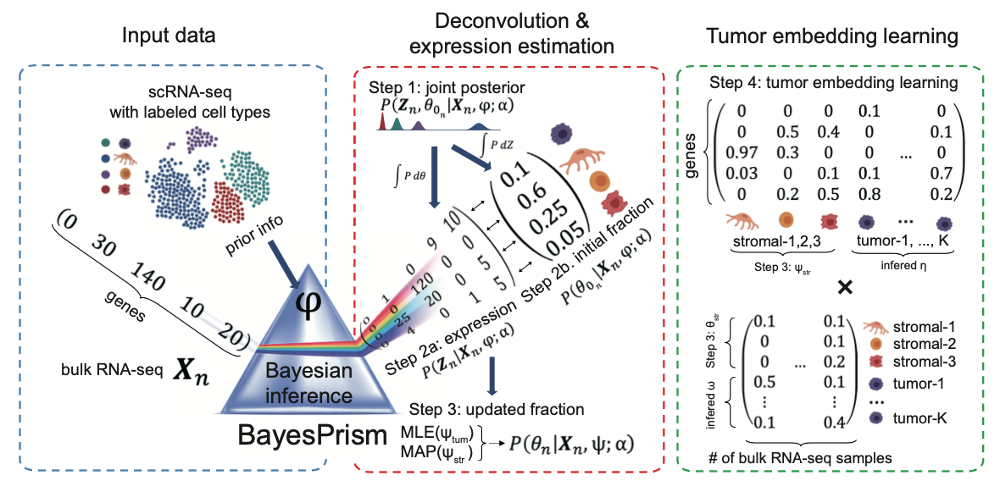

TED
========

Tumor micro-Environment Deconvolution (TED): A Fully Bayesian Inference of Tumor Microenvironment composition and gene expression

TED is comprised of the deconvolution modules and the embedding learning module. The deconvolution module leverages cell type-specific expression profiles from scRNA-seq and implements a fully Bayesian inference to jointly estimate the posterior distribution of cell type composition and cell type-specific gene expression from bulk RNA-seq expression of tumor samples. The embedding learning module uses Expectation-maximization (EM) to approximate the tumor expression using a linear combination of tumor pathways while conditional on the inferred expression and fraction of non-tumor cells estimated by the deconvolution module. 


Cite TED:
--------
Bayesian Inference of Cell Composition and Gene Expression Reveals Tumor-Microenvironment Interactions

Tinyi Chu and Charles Danko

--------


Workflow of tfTarget
--------



Requires
--------

* R packages:
	
	DESeq2, parallel, MCMCpack, gplots
	
Installation
--------

* If all dependent packages and commands have been installed, please use the following codes to install/update the package in R terminal. 

```````
library("devtools");
install_github("Danko-Lab/TED/TED")
```````


Usage
----------
library(TED)

use ?function_name for more details

utility function:
norm.to.one

R functions:
run.Ted, learn.embedding.withPhiTum, learn.embedding.Kcls

	
Output
----------
use ?function_name for more details


Generating the reference expression matrix from scRNA-seq data
----------------------------------------------------------------------
TED assumes that the expression profiles for all stromal cells are observed. As a result, we recommend the use of complete enumeration of cell types whenever possible. For example, when information on subtypes of T cells, such as CD4+, CD8+, Treg, etc, are available, user should use the individual subtype as the reference rather than a generic “T cell” by collapsing multiple subtypes. There are two advantages for this. First, this enables the inference on subtype-specific fractions. Second, the sum of the fraction across subtypes is usually greater than that of a generic “T cell”, and often yields a more accurate estimates of cell type fractions. To prepare for a reference with a complete coverage on cell types, scRNA-seq methods with higher cell number but lower sequencing depth per cell, such as 10X and Drop-seq, is often more desirable than those with the opposite features, such as Smart-seq. When the completeness assumption is violated, the fractions of each of the remaining cell types will become inflated, with the extent of inflation determined by the similarity in their expression to the missing cell type(s). 

Although TED does not assume the expression of tumor cells are completely observed in the scRNA-seq reference, its performance depends on the extent to which the reference tumor expressions represents those in bulk RNA-seq. To obtain the best possible representation for the unobserved tumor expression in bulk RNA-seq, we recommend users to cluster the scRNA-seq data of tumor cells in individual patients, and then collapse the expression profile for individual cluster in each patient to generate the reference for tumor cells. The number of patients needed for the reference mostly depends on the degree of heterogeneity of the tumor. In the deconvolution of GBM, the 60 tumor cell clusters from 8 patients generated by Yuan et al. was sufficient to achieve a good performance. We recommend users to determine the representativeness of the tumor cells by running the leave-one-out test, and then decide if the collection/curation for additional tumor samples are needed. In addition, users should be cautious when normal tissues of highly similar transcription profiles to the tumor cells are included in the reference, especially those represents the tumor cell origins. For example the inclusion of normal astrocyte to deconvolve GBM may cause the astrocyte to be overestimated and the tumor cells to be underestimated. Such issue resulted from highly similar transcription profile will only affect the inference of tumor cells, but not stromal cells (such as the inference of multiple subtypes of T cell), due to the under-representativeness of tumor cells in the reference caused by tumor heterogeneity.  Note that this issue is not specific to TED. In fact, any regression approaches will suffer when one reference component does not sufficiently represent that in the mixture while additional components of similar expression profiles are also included in the reference. Nevertheless, most stromal cells, such as immune, endothelial, fibroblast and even oligodendrocytes in GBM do not show this issue across three tumor types we tested. Besides, this issue can often be avoided by domain knowledge or running the leave-one-out test.

Different RNA-seq platforms may contain systematic batch effects that cannot be corrected by TED. Loosely speaking, TED can correct batch effects for genes where the relative  expression holds across platforms. Therefore, genes that are detectable in one batch but are not detectable in the other should be excluded. We found a systematic enrichment in the non-coding genes in refGBM8 compared to the TCGA dataset, and hence removed these genes in constructing the reference profile. Also genes on the Y chromosome are also excluded in the reference. 

TED uses the raw count to generate the reference profile, and normalizes each cell by its total count. To avoid exact zeros in the reference profile. The TED R package provides a function norm.to.one to add a computed pseudo count to each cell type, such that after normalization the zero counted genes have the same value (default=10-8) across all cell types. Ideally users should keep the sequencing depth roughly the same across cell types, but in general, TED is robust to the variation in the sequencing depth, and maintains the relative ratio in inferred fractions even if an extremely shallowly sequenced cell type is used, such as the T cell in refGBM8. 

Interpreting the results of deconvolution
--------------------------------------------------
TED keeps both θ0, the initial estimates of cell type compositions, and θ, the updated estimates of cell type compositions in the output. In most cases, users should use the updated θ as it often improves over the initial estimates. Occasionally in some cases, the initial estimates θ0 shall be used. For example, the mixture contains small amount of tumor fraction (<50%), or the reference and mixture do not have batch effects, e.g. reference profiles are obtained from the same bulk RNA-seq platforms from flow-sorted cells. 


Documents
----------

* R vignette:
 (Coming soon)

* R manual:
 (Coming soon)
